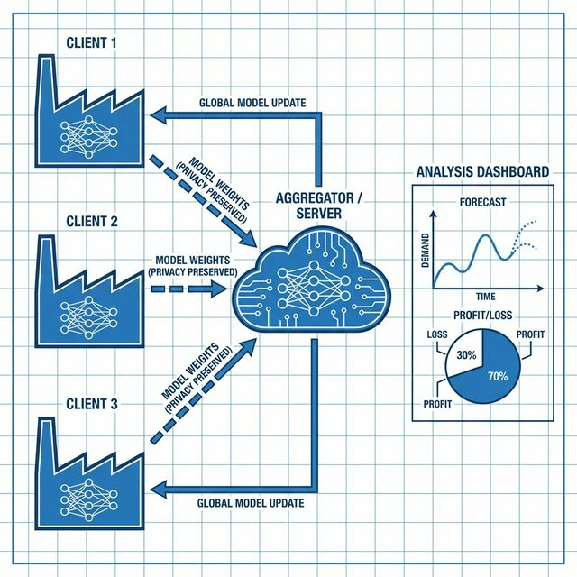

# Federated Learning for Supply Chain Optimization (Milk)

## Overview
This project simulates a **Federated Learning (FL)** system to optimize the supply chain for a perishable product ("Milk"). It predicts future demand using a distributed **LSTM (Long Short-Term Memory)** neural network, ensuring data privacy by keeping raw data on local clients and only sharing model updates.

## System Architecture
How the system works:
1.  **Local Training**: Each client (Retail, Warehouse, Logistics) trains a local LSTM model on their private sales data.
2.  **Federated Averaging**: Clients send their model weights (not data!) to the central server.
3.  **Aggregation**: The server averages these weights to create a "Global Model" that is smarter than any single client.
4.  **Privacy**: Differential Privacy noise is added to the weights to prevent reverse-engineering.
5.  **Optimization**: The global forecast is used to calculate the optimal order quantity, balancing profit, waste, and carbon emissions.



## Key Features
-   **Federated LSTM**: Time-series forecasting without sharing raw data.
-   **Differential Privacy**: Laplacian noise added to gradients for security.
-   **Optimization Engine**: Balances Inventory vs. Spoilage vs. Carbon Cap.
-   **Interactive Dashboard**: Streamlit UI for real-time simulation and "What-If" analysis.

## Setup & Run

1.  **Install Dependencies**:
    ```bash
    pip install -r requirements.txt
    ```

2.  **Run the Simulation**:
    ```bash
    streamlit run app.py
    ```

## Project Structure
-   `main.py`: Core logic for FedSim, LSTMModel, and Optimization.
-   `app.py`: Streamlit Dashboard implementation.
-   `requirements.txt`: Python dependencies.
