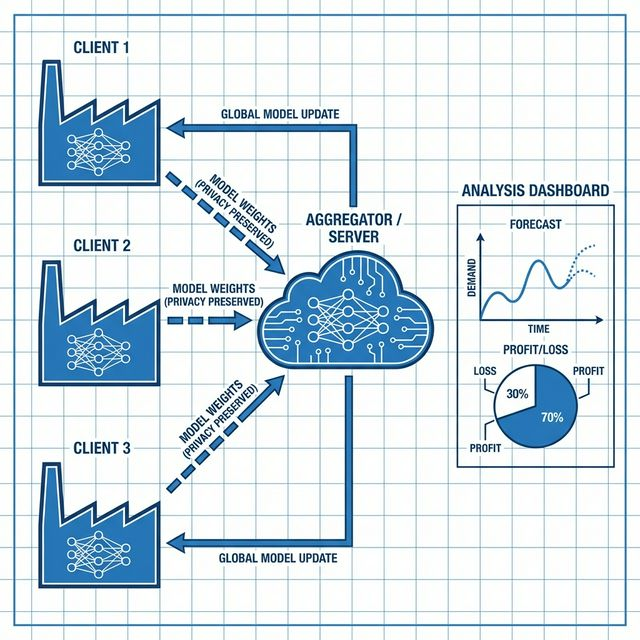

# Federated Learning for Supply Chain Optimization (Milk)

## Overview

This project simulates a Federated Learning (FL) system to optimize the supply chain for a perishable product (Milk). It predicts future demand using a distributed LSTM (Long Short-Term Memory) model, keeping raw data local to each client and sharing only model updates.

## System Architecture

How the system works:

1. Local training: Each client trains a local LSTM model on private sales data.
2. Federated averaging: Clients send model weights (not raw data) to the server.
3. Aggregation: The server averages weights into a global model.
4. Privacy: Differential privacy noise is added to model updates.
5. Optimization: The forecast drives order quantity decisions while balancing profit, waste, and emissions.



## Key Features

- Federated LSTM forecasting without sharing raw client data.
- Differential privacy noise injection for extra protection.
- Optimization logic for inventory, spoilage, and carbon-cap feasibility.
- Streamlit dashboard for simulation, charts, and what-if analysis.
- Automatic currency detection from dataset headers/content with manual fallback.
- Native folder picker buttons for selecting Dataset and Log directories.
- AI Insight responses constrained to concise, round-specific tactical guidance.

## Setup and Run

1. Install dependencies:

```bash
pip install -r requirements.txt
```

1. Start the dashboard:

```bash
streamlit run app.py
```

## Troubleshooting

- If you see repeated ModuleNotFoundError logs for torchvision while starting Streamlit, this project includes .streamlit/config.toml with file watcher disabled.
- This avoids Streamlit module-watcher introspection of optional Transformers vision modules that are not required for this text-only TinyLlama workflow.

## Real Data Mode (Implemented)

- Place client CSV files inside DATASETS.
- Example file names: client_1_amul_gujarat.csv, client_2_mother_dairy_delhi.csv, client_3_sudha_bihar.csv.
- In the Streamlit sidebar, set Data Source to real.
- Use Browse Dataset Directory to select the dataset folder, or type the path manually.
- Use Browse Log Directory to select where logs should be written, or type the path manually.

The app now loads real client data directly from CSV and uses:

- demand as the forecasting target.
- disruption_prob for safety-stock risk logic.
- emission_factor for carbon-impact checks.

### Currency Behavior

- The app scans dataset headers and sampled text values to detect currency markers.
- If a currency is detected (for example INR, USD, EUR), financial output is labeled with that currency.
- If no currency marker is found, the app uses the Manual Currency (Fallback) selection in the sidebar.
- If multiple currencies are detected across client files, the app shows a warning and uses the first detected currency.
- Currency behavior is display-only and does not apply exchange-rate conversions.

### AI Insight Behavior

- AI Insight is constrained to 2 to 3 concise sentences focused on the current round.
- The app validates responses for relevance (forecast/order/emissions/profit/risk context).
- AI Insight uses a faster single-pass generation profile to reduce wait time.
- If output is low-confidence, the app shows a deterministic fallback recommendation from current round metrics.

Supported currencies:

- INR (Indian Rupee)
- USD (US Dollar)
- EUR (Euro)
- GBP (British Pound)
- JPY (Japanese Yen)
- CNY (Chinese Yuan)
- AUD (Australian Dollar)
- CAD (Canadian Dollar)
- CHF (Swiss Franc)
- SGD (Singapore Dollar)

If fewer client CSV files are found than the selected client count, remaining clients are automatically backfilled with synthetic data.

## Project Structure

- main.py: Core logic for federated training, data management, and optimization.
- app.py: Streamlit dashboard.
- requirements.txt: Python dependencies.
